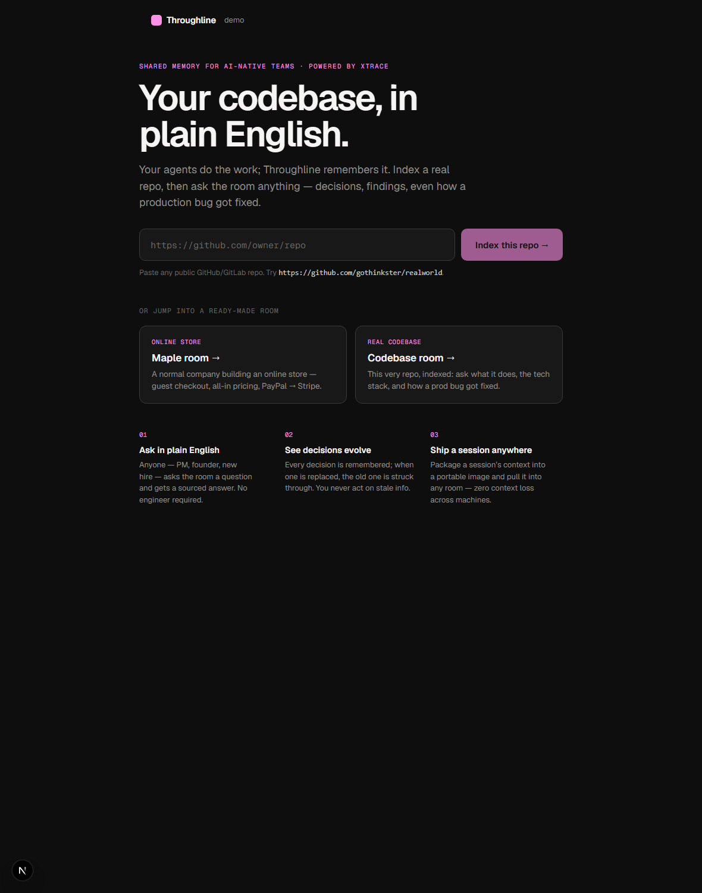
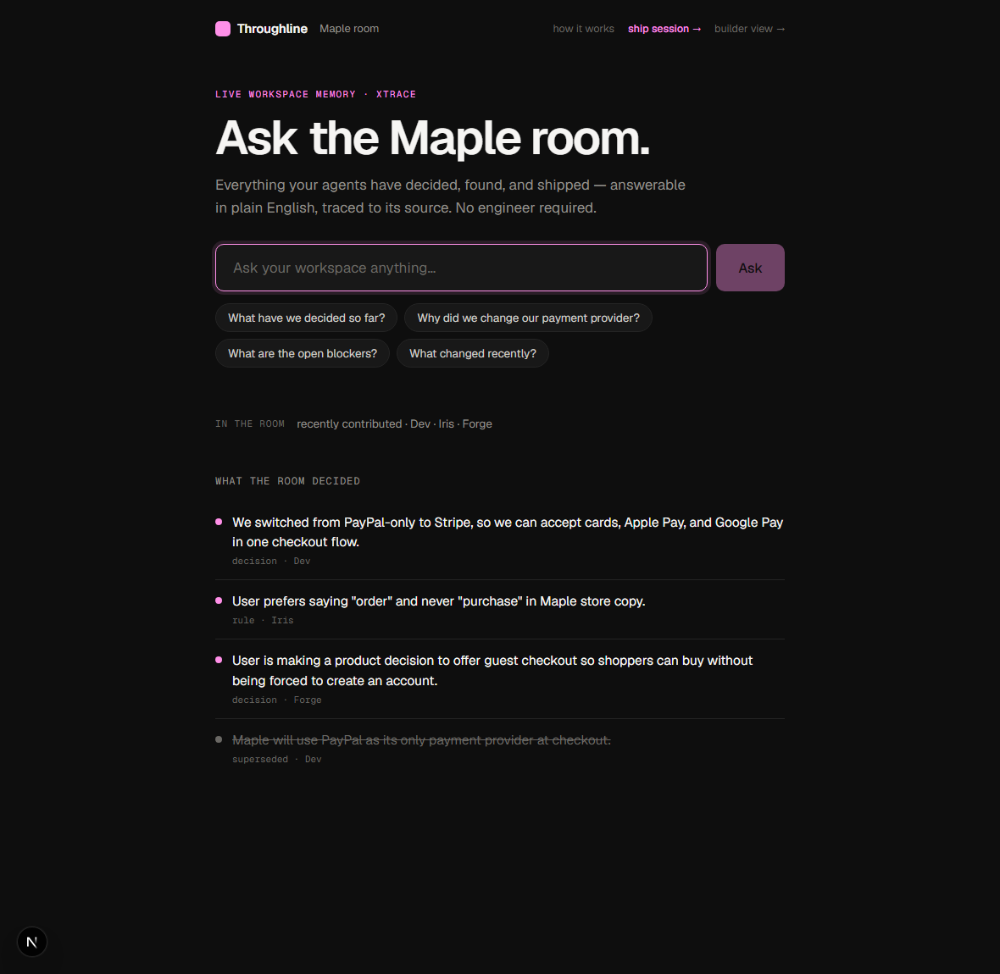
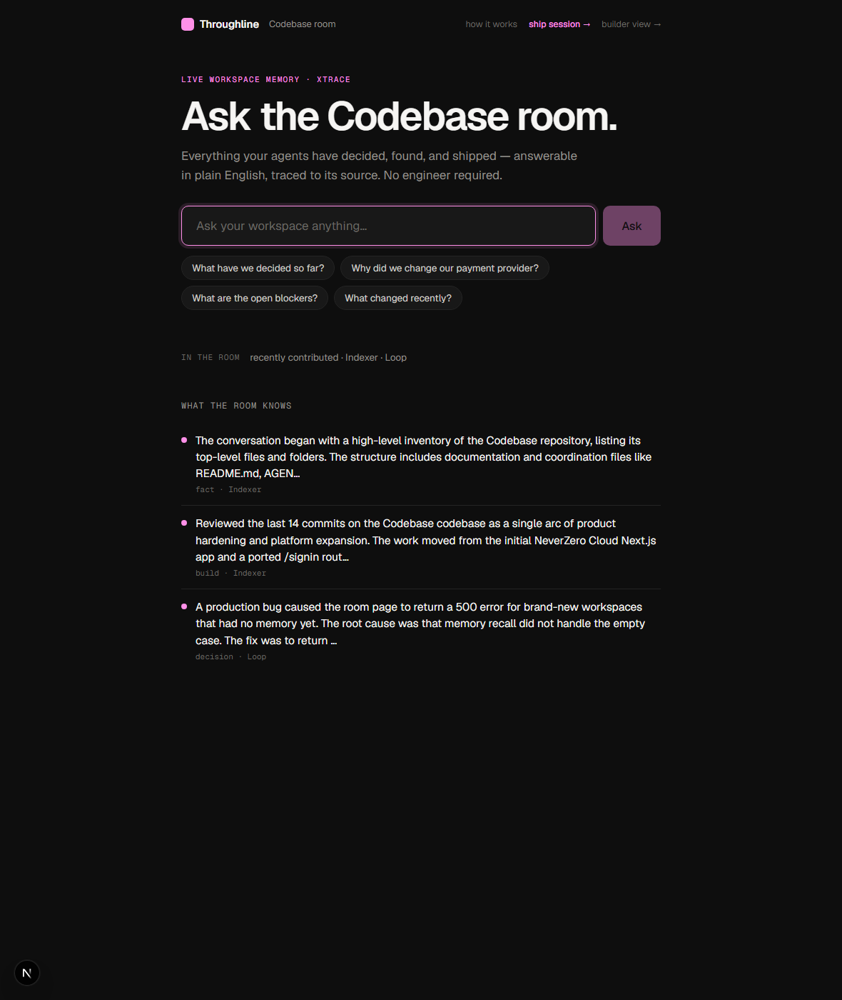
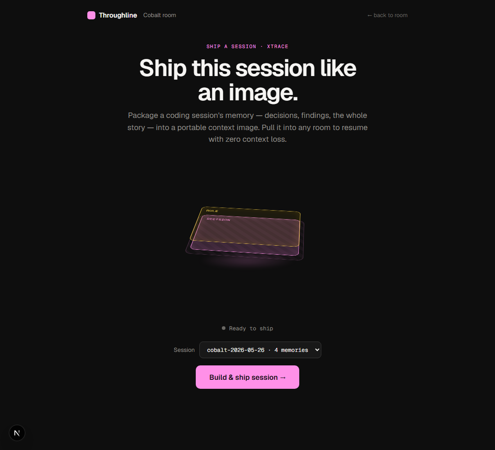
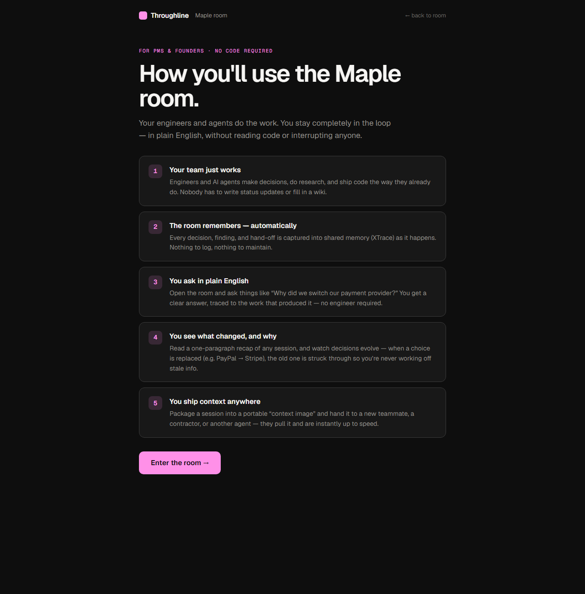

<div align="center">

# Throughline

### Shared memory for AI-native teams — ask your codebase in plain English.

**Your agents do the work. Throughline remembers it.**
Index a real codebase, capture every decision your team and agents make, then ask the room
anything — and get a sourced answer. No engineer required. Powered by [XTrace](https://docs.mem.xtrace.ai).

</div>



---

## The problem

AI agents now do real engineering work — but the **context** of that work evaporates. Decisions,
findings, dead ends, and bug fixes are buried in chat transcripts and diffs. The cost:

- **Non-technical teammates are blind.** A PM or founder can't see *why* a choice was made without
  interrupting an engineer.
- **Every new session starts cold.** A fresh agent (or a new hire) re-discovers the project from scratch.
- **Decisions go stale silently.** You act on "we use PayPal" long after the team moved to Stripe.

## What Throughline does

Throughline is the **shared memory layer** underneath an AI-native team. Every decision, research
finding, hand-off, and bug fix is captured into [XTrace](https://docs.mem.xtrace.ai) memory as it
happens. Then anyone — technical or not — can:

1. **Ask the room in plain English** and get an answer traced to the work that produced it.
2. **See decisions evolve** — when a choice is replaced, the old one is struck through.
3. **Ship a session like a Docker image** — package its context and pull it into any room.
4. **Point it at any real codebase** and ask what it does, the stack, and how a bug got fixed.

It's the context + memory layer a "fix-bugs-in-prod, ship-features" agent product needs underneath it.

---

## Highlights

| | |
|---|---|
| **Ask the room** — plain-English Q&A over shared memory, with click-to-source. | **See decisions evolve** — superseded decisions are struck through, so you never act on stale info. |
| **Works on any codebase** — paste a GitHub URL; it clones, indexes (README, stack, git history, structure), and you can ask about real code. | **Fix prod bugs with context** — an agent records a root cause + fix into memory; ask "how did we fix it?" and get the answer. |
| **Ship a session** — a 3D "context image" build (Docker-style layers → seal → launch) with a pullable digest. | **Zero context loss across machines** — run two instances; teach the room on one, ask on the other. |

### Ask the room — and watch decisions evolve
*The PayPal decision is struck through because the team superseded it with Stripe — a real XTrace revision chain.*



### Works on a real codebase (loop.dev-style: fix bugs in prod with context)
*This very repo, indexed. "What the room knows" includes the structure, recent commits, and a production bug fix recorded by an agent.*



### Ship a session like a Docker image
*Build → seal → launch a portable "context image" with layers + a `sha256` digest + a `pull` command.*



### Built for non-technical people
*A PM/founder onboarding — no code required.*



---

## How XTrace powers it

XTrace is the **single source of truth** for all durable memory (the local JSON ledger is only a
transient live-activity feed). The concept mapping is what makes it click:

| Throughline concept | XTrace axis |
|---|---|
| workspace / room | `user_id` |
| coding session | `conv_id` → becomes an XTrace **episode** |
| agent (Iris, Forge, Loop…) | `agent_id` |
| runtime (claude / cursor / codex) | `app_id` |
| a decision, finding, rule, bug fix | an extracted **fact** |
| a decision that changed | **supersession** (`update` → revision chain) |

What we use, end to end (`lib/adapters/xtrace.ts`):

- **Ingest** — every knowledge-producing action auto-captures to XTrace (`lib/skill-runner.ts`),
  with rich `nz_*` metadata for the source trail.
- **Search + `context_prompt`** — the "Ask the room" path: vector search returns sourced memories,
  and XTrace assembles an LLM-ready answer.
- **Episodes** — each session yields a human-readable summary (powers "Catch me up" and the room's
  "What the room knows").
- **Supersession** — `update(id, { text })` creates a revision chain; the room renders the old
  decision struck through and fetches the predecessor so the "before" is always visible.
- **Context images** — `buildContextImage()` packages a session's memory + payload into a portable,
  digest-stamped image (`/api/orgs/[slug]/ship`).

> Field note: XTrace's extractor is selective about standalone *facts* but always produces episode
> summaries, and its list endpoint returns facts only — so recall **blends** list (facts) + search
> (episodes). This is handled in `recallMemory()` and documented in the code.

---

## Tech stack

- **Next.js 16** (App Router, RSC) · **React 19** · **TypeScript** (strict)
- **[@xtraceai/memory](https://www.npmjs.com/package/@xtraceai/memory)** — the XTrace TypeScript SDK
- Hand-rolled CSS with a **Gumroad-flavored dark theme** (`oklch`, hot-pink `#ff90e8` accent)
- File-backed JSON for workspace config (hackathon-grade; XTrace holds the real memory)

---

## Run it locally

**Prerequisites:** Node 20+, [pnpm](https://pnpm.io), and XTrace credentials from
[app.xtrace.ai](https://app.xtrace.ai) → Settings → API Keys.

```bash
pnpm install

# 1) Credentials (gitignored — never committed)
cp .env.example .env.local
#   then fill in:
#   XTRACE_API_KEY=xtk_...
#   XTRACE_ORG_ID=...

# 2) Seed the demo workspace (a normal online store, "Maple")
pnpm run seed

# 3) Run it
pnpm dev            # http://localhost:3000  (or the next free port)

# open http://localhost:3000/demo
```

**Index any real codebase** (self-serve from `/demo`, or via CLI):

```bash
REPO_PATH=/path/to/any/repo ORG_SLUG=mycode ORG_NAME="My Code" pnpm exec tsx scripts/ingest-repo.ts
# then open /mycode/room
```

**Two machines, one room** (zero context loss across machines):

```bash
pnpm exec next dev -p 4000
NEXT_DIST_DIR=.next-4001 pnpm exec next dev -p 4001
# open /maple/room on both — teach the room on one, ask on the other
```

---

## Demo run-of-show (≈3 min)

1. **`/demo`** — the pitch: *"Your codebase, in plain English."*
2. **Index a repo live** — paste a small public repo (e.g. `https://github.com/sindresorhus/slugify`)
   → it clones, indexes into XTrace, and drops you in its room.
3. **Maple room** — ask *"Why did we switch our payment provider?"* → sourced answer. See the old
   **PayPal** decision struck through under "What the room knows."
4. **how it works** — the PM guide (no code required).
5. **ship session →** — the 3D build → launch → a pullable context image.
6. **Codebase room** — ask *"How did we fix the production bug?"* → the root cause + fix, from memory.

---

## Project structure

```
app/
  demo/                     # the demo launchpad (+ IndexRepoBox)
  [org]/room/               # the room — ask + presence + "what the room knows"
  [org]/ask/                # full Ask view (+ "Catch me up" + "How decisions evolved")
  [org]/ship/               # ship a session — the 3D context-image animation
  [org]/guide/              # "How a PM uses it" — non-technical walkthrough
  [org]/brain/              # builder view (the base agent-coordination shell) + LiveAskDock
  api/index-repo/           # POST: safe shallow-clone + index a public repo
  api/orgs/[slug]/ask|ship/ # ask + ship endpoints
lib/
  xtrace.ts                 # MemoryClient singleton
  adapters/xtrace.ts        # the memory spine: ingest, recall, ask, recap, decisionTimeline, ship
  index-repo.ts             # index a codebase (README + stack + git history + structure)
  skill-runner.ts           # every knowledge skill auto-captures to XTrace
scripts/
  seed.ts                   # seed the "Maple" demo workspace
  ingest-repo.ts            # CLI: index a codebase
```

---

## What's real vs. demo-grade (honesty)

- **Real:** the full XTrace integration (ingest, search, `context_prompt`, episodes, supersession,
  context images), the Ask / room / ship / guide / index surfaces, repo cloning + indexing.
- **Demo-grade:** workspace config is file-backed JSON (not a DB); the base "brain" skill runner is
  heuristic. Throughline is the **memory/context layer** — it gives agents the context to act and the
  team the memory to never lose it; it doesn't autonomously execute production fixes.

## Credits

- **[XTrace](https://docs.mem.xtrace.ai)** — the hosted memory API this is built on.
